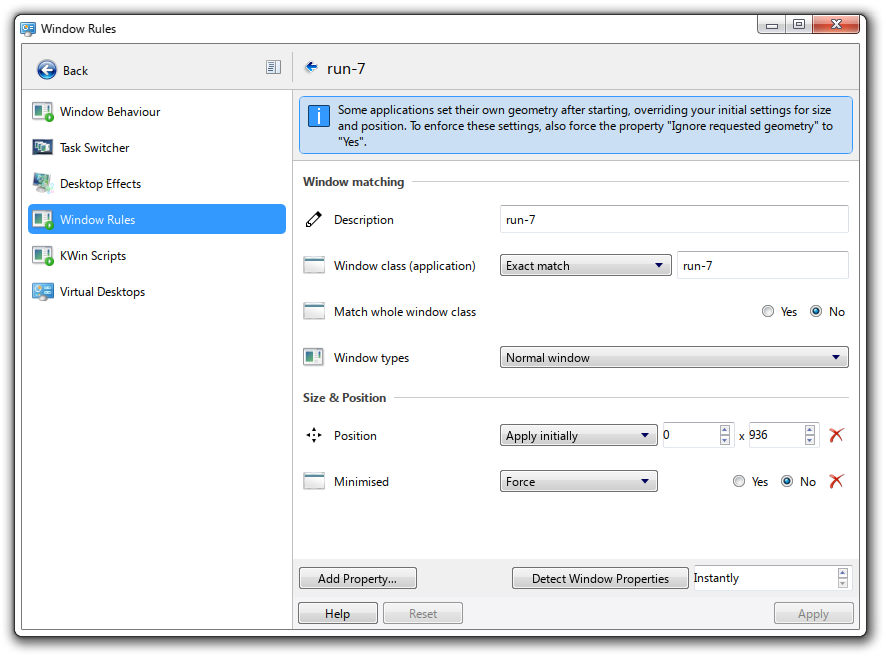
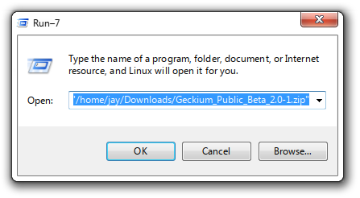
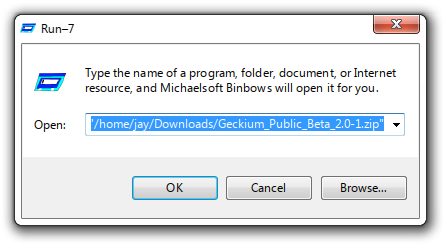
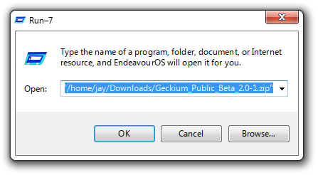
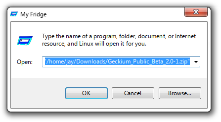

# Config

## General
- On Windows: `\HKEY_CURRENT_USER\Software\JayRickaby\Run-7`(I am aware this sucks as you need to use RegEdit.)
- On Linux: `~/.config/JayRickaby/Run-7.conf`

## KDE Plasma
You can make the Window more accurate by applying a Window Rule, such as:

I calculate the y-position based off my screen height, window height and taskbar height.
e.g. `1200` - `~216` - `~48` respectively = `936`. However, this is buggy and currently affects all windows!

It is highly recommended you use this alongside [AeroThemePlasma](https://gitgud.io/aeroshell/atp/aerothemeplasma).

## Settings
### [Appearance]
#### icon
*Acceptable Values: `Any valid local file`*

This will prefer to use your icon of choice.

#### osOverride
*Acceptable Values: `Any valid string`*

This will prefer to use a name of your choice for all instances of the OS.

*Note: This will override `prettyOsName`!*

#### prettyOsName
*Acceptable Values: `true`, `false`*

This will prefer to use the more elaborate version of your system. 
e.g. 
- Linux → EndeavorOS (whatever distribution you are using)
- Windows → Windows 11

*Note: This will be overridden by `osOverride`!*

#### title
*Acceptable Values: `Any valid string`*

This will prefer to use a name of your choice for all instances of the application title.

### [History]
#### limitHistorySize
*Acceptable Values: `Any valid unsigned integer`, `-1`*

- This will cause the URL History to become a queue (follows FILO). It will have a size of whatever has been designated.
- A size of `-1` means that there is no limit to the history.
- History will be shrunk on application open/close.
